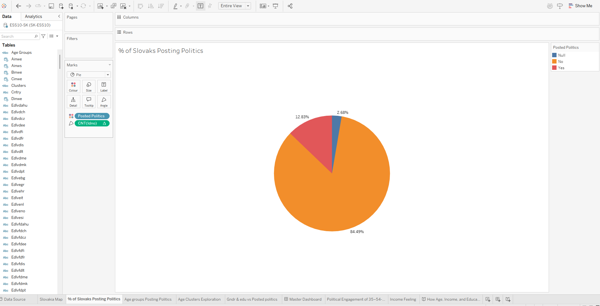
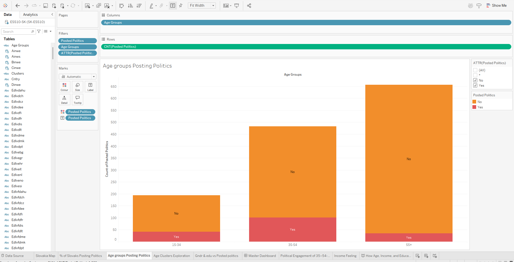
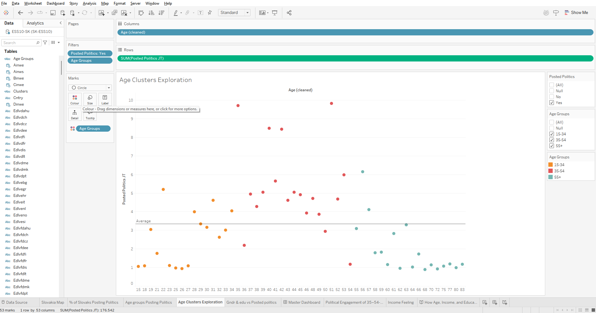
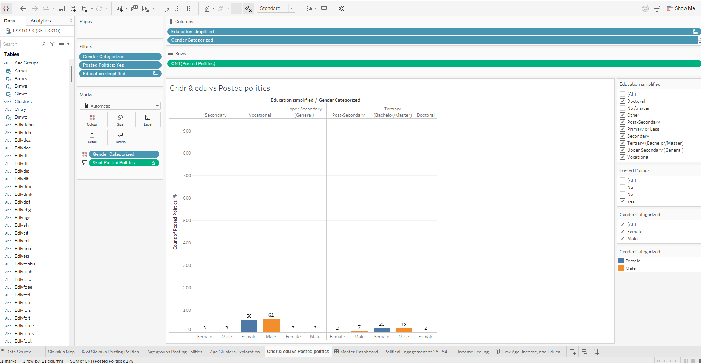
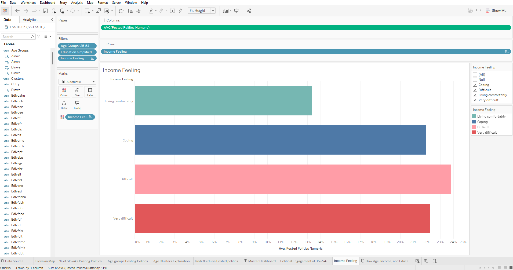

# How Age, Income, and Education Drive Online Political Engagement in Slovakia  
**Data Visualisation & Customer Insights Case Study (Tableau)**

## Overview
This project analyses **33,351 survey responses** from the **European Social Survey (ESS)** to understand how **age, income stress, and education** influence **online political engagement** in Slovakia.

The objective was not just to visualise data, but to **identify which demographic groups are most likely to express political voice online** and translate those insights into **clear, evidence-based conclusions**.

---

## Business Problem
Public institutions, media organisations, and policy teams increasingly rely on online engagement signals to understand political sentiment.  
However, **online political participation is uneven across demographic groups**, which can bias interpretation.

This analysis addresses:
- Who is most likely to post about politics online?
- How do **financial stress, age, and education** shape engagement?
- Which groups are **underrepresented or overrepresented** in digital political discourse?

---

## Data
- **Source:** European Social Survey (ESS)
- **Total records analysed:** 1,418 (Slovakia only)
- **Data type:** Survey responses
- **Key variables used:**
  - Online political posting behaviour
  - Age
  - Education level
  - Household income feeling
  - Gender
  - Employment status

> ⚠️ Raw ESS data exceeds GitHub size limits.  
> Analysis was performed on a **Slovakia-filtered dataset (1,418 records)**.  
> Full dataset and codebook are publicly available via the European Social Survey.

---

## Analytical Approach
1. **Data preparation**
   - Filtered ESS dataset to Slovakia
   - Converted coded variables into human-readable categories
   - Created calculated fields for age groups, income stress, and posting behaviour

2. **Visual analytics (Tableau)**
   - Demographic segmentation
   - Cluster exploration using jittered scatter plots
   - Interactive dashboards and storyboards for narrative flow

3. **Insight synthesis**
   - Focused on patterns that explain *why* engagement differs, not just *what* differs

---

## Key Visuals & Insights

### 1. Overall Political Posting Behaviour

Only a **minority of respondents post political content online**, highlighting that digital political voice is concentrated among specific groups.

---

### 2. Age as a Primary Driver

- **Ages 35–54** are the most politically active online.
- This group posts **above the dataset average (3.3 posts)**.
- Younger (15–34) and older (55+) groups show significantly lower activity.

---

### 3. Cluster Analysis: Age vs Posting Frequency

- The **35–54 cluster** contains multiple high-frequency posters (9–10+ posts/year).
- Posting behaviour is **not evenly distributed**, as engagement is driven by a small, highly active subgroup.

---

### 4. Education & Gender Effects

- Education level shows a **moderate relationship** with posting.
- **Gender differences are minimal**, suggesting engagement gaps are driven more by **life stage and economics** than gender.

---

### 5. Income Stress as a Key Insight

**Most important finding:**

> Individuals aged **35–54** who report **financial difficulty** (“Difficult” / “Very difficult”) are **significantly more likely to post political content online** than those living comfortably.

This suggests **economic pressure amplifies political voice**, not apathy.

---

## Core Insight (Executive Summary)
> **Financial stress fuels political expression.**  
> In Slovakia, online political engagement is strongest among **middle-aged individuals experiencing economic difficulty**, rather than among the most educated or wealthiest groups.

---

## Business & Policy Implications
- **Online political discourse is not representative of the full population**
  - Voices of financially stressed, middle-aged individuals are amplified
- **Digital engagement metrics may over-index economic dissatisfaction**
- Policymakers and analysts should:
  - Avoid assuming online sentiment reflects general public opinion
  - Segment engagement analysis by **income stress and age**
- Media and civic organisations can:
  - Tailor communication strategies to underrepresented groups
  - Use targeted outreach to balance participation gaps

---

## Tools & Techniques
- **Tableau Desktop**
  - Calculated fields
  - Interactive dashboards
  - Storytelling with data
- **Data visualisation techniques**
  - Cluster exploration
  - Jittered scatter plots
  - Demographic segmentation
- **Analytical skills demonstrated**
  - Insight framing
  - Business interpretation
  - Clear communication for non-technical stakeholders

---

## Repository Structure
